# Warcom Command

A from-scratch TypeScript/web port of **Warcom**, David Eubanks' 1991–2004 DOS
companion program for *War Law* — Iron Crown Enterprises' mass-combat
system for Rolemaster. It runs the same combat math as the original compiled
program, with a browser-based roster, attack queue, battle log, and full
read/write support for the original `.UNT`/`.BTL` save files.

This repository contains:

- **The engine and web app source** (`src/`, `dist/`) — a faithful,
  differentially-tested port.
- **The original DOS source**, untouched (`legacy/`) — the ground truth
  everything else in this repo is checked against.
- **The test suite** (`tests/`) — including a harness that compiles the real
  original C++ and runs thousands of randomized battles through both it and
  the TypeScript engine, comparing results exactly.
- **A standalone offline build** (`warcom-command-offline.zip`) — the same
  app, pre-bundled so it runs from a double-clicked `index.html` with no
  server and no internet connection.

Jump to: [Where this came from](#where-this-came-from) ·
[How it was ported](#how-it-was-ported) ·
[Running it](#running-it) ·
[Repository layout](#repository-layout) ·
[User manual](#user-manual) ·
[License](#license)

---

## Where this came from

*War Law* was published in 1991 as Rolemaster's system for resolving large
battles — whole units fighting whole units, rather than one character at a
time. Warcom was a companion DOS program that automated War Law's combat
math: it reads unit rosters and attack orders, rolls percentile combat
results exactly as the tabletop rules specify, and tracks casualties and
morale across a battle.

Source: **[github.com/code-moth/Warcom](https://github.com/code-moth/Warcom)**
(`main` branch), by David Eubanks, released under **GPL-3.0**. The original
`README.md` in `legacy/` says it best:

> This program was written as a companion to War Law, a Rolemaster system
> for large scale fantasy combat from Iron Crown Enterprises, originally
> published in 1991, and now long out-of-print. It is released here in
> source code form with the permission of its' author. It needs some
> serious updating to give it a modern user interface...

This project is that modern interface — built directly from the original
`main` branch's C++ source, not from any other existing rewrite.

## How it was ported

The goal was bit-for-bit fidelity to the original program's combat math, not
just a plausible re-implementation of the rules. That meant treating the
compiled C++ as the specification, and verifying against it directly rather
than trusting a manual read of the code.

**Differential testing against a compiled oracle.** `tests/reference/`
lightly patches the original `RESOLVE.CPP` (only enough to make it compile
standalone — see `tests/reference/build.sh`) and compiles it into a small
command-line harness. `tests/engine-vs-original.test.mjs` generates hundreds
of randomized units and attacks, feeds each one through both the real
compiled C++ and the TypeScript engine, and asserts every output field
matches exactly — hit counts, casualties, damage, morale, special-critical
outcomes, across every target size class.

**Numeric fidelity.** The original is single-precision C `float` arithmetic
with specific random-number routines:

- `Rng.rand()` reproduces Borland C's specific linear congruential
  generator (not glibc's — they differ) for die rolls.
- `Rng.ran1()` is a direct port of the Park–Miller generator with a
  Bays–Durham shuffle, used for continuous values.
- `Rng.gasdevZpos()` ports the original's Box–Muller transform.
- Every intermediate result that would have been a C `float` is rounded
  with `Math.fround()` so the two implementations drift identically or not
  at all.

**Data, not retyped.** The critical-hit tables and weapon tables aren't
hand-transcribed — `tools/gen-tables.mjs` and `tools/gen-weapons.mjs`
extract them programmatically from `legacy/RESOLVE.CPP` and
`legacy/WEAPONS.DAT` into `src/engine/tables.ts` and
`src/data/weapons-dat.ts`, so a transcription error simply can't happen.

**A genuine bug, reproduced on purpose.** Armor type is documented
throughout War Law as **AT1–AT20** (1-indexed), but the original C++ used
that value directly as a subscript into a zero-based, 20-element array:

```cpp
// legacy/RESOLVE.CPP (abridged)
int at = atArmorType;               // 1..20, as entered
WeaponRow &row = weapon->rows[at];   // but rows[] is 0-indexed!
```

So armor type 1 actually read the AT2 column, every armor type 2–19 was off
by one column, and armor type 20 wrapped around to read AT1. This isn't a
rules interpretation — it's confirmed directly against the compiled
original and covered by the differential tests. `src/engine/resolve.ts`
implements both mappings and a **Legacy armor indexing** setting in the app
picks between them: on, to reproduce the original exactly (so old results
stay reproducible); off (the default for new battles) for the corrected
1-to-1 mapping.

```ts
// src/engine/resolve.ts
export function armorIndex(armor: number, legacy: boolean): number {
  if (legacy) {
    const at = armor;
    return at < 0 || at > 19 ? 0 : at;              // reproduces the original bug
  }
  return armor >= 1 && armor <= 20 ? armor - 1 : 0;  // corrected mapping
}
```

**The legacy file formats.** `.UNT`/`.BTL` files are fixed-width,
NUL-terminated ASCII records, reverse-engineered from the original's
read/write code (`src/engine/legacy-io.ts`). They also carry a real quirk:
a save/restore overlap in the original means some files run a few bytes
longer than `records × recordSize`; the reader accepts both lengths, and
`tests/legacy-io.test.mjs` round-trips files in both forms.

## Running it

Requires Node.js 18+ (uses `node:test`) and, for `npm run test:reference`
specifically, a C++ compiler (`g++` or similar).

```sh
npm install
npm run build          # tsc, then copies build/ into dist/engine and dist/data
npm test                # runs the full suite, including the engine-vs-original.test.mjs smoke checks
npm run test:reference  # compiles the real original C++ into tests/reference/out/reference,
                         # which unlocks the full differential battle comparisons
npm test                # run again with the reference binary present for full coverage
```

To use the web app itself, serve `dist/` with any static file server and
open `index.html` — it's plain HTML/CSS/JS with ES module imports, so it
needs `http(s)://`, not a bare `file://` double-click (the bundled offline
build below is for that). For example:

```sh
cd dist && python3 -m http.server 8080
# then open http://localhost:8080/
```

`dist/index.html` loads Google Fonts and JSZip (for legacy file zipping)
from a CDN; `warcom-command-offline.zip` is the same app with both of those
made local, for running with no internet access at all (see below).

## Repository layout

```
.
├── src/engine/        TypeScript combat engine (types, rng, resolve, model, legacy-io, weapons, tables)
├── src/data/           Generated: the original WEAPONS.DAT, embedded as a TS constant
├── dist/                The deployable web app: index.html + app.js (hand-written),
│                         plus engine/ and data/ (compiled from src/, copied in by `npm run build`)
├── legacy/              The original DOS C++ source, untouched — the ground truth
├── tests/                node:test suite, including the C++ reference-oracle harness
├── tools/                Codegen scripts (tables/weapons) and the build's copy step
├── docs/screenshots/     Screenshots used in the user manual below
└── warcom-command-offline.zip   Prebuilt, fully offline runtime (see inside for its own README)
```

## User manual

### The layout

The app opens on a sample battle ("Training bout (sample)") so you can see
how everything fits together before building your own.

- **Roster rail** (left) — every unit, with strength percentages and
  stamps showing who's attacking (**A**) or defending (**D**) this round.
- **Tab strip** — Unit, Attacks, Battle log, Weapons, Settings.
- **Dispatch bar** (top) — battle name, a live count of queued attacks and
  the current round, and **Resolve queue**.

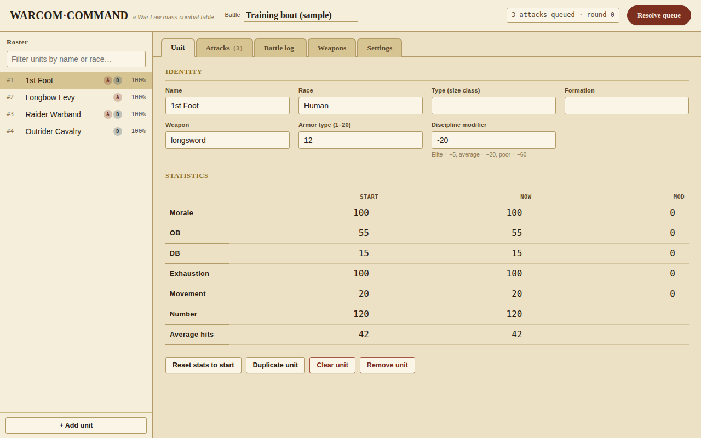

Click any unit in the roster to load it into the Unit tab. Click a tab name
to switch panels — it's all one page, nothing reloads.

### Managing units

1. **Add a unit** — click **+ Add unit** at the bottom of the roster rail.
2. **Identity** — `Name`, `Race`, `Type (size class)`, `Formation` are free
   text; `Type` drives which critical-table size class the unit uses
   (small, normal, large, and so on).
3. **Combat basics** — `Weapon` must match a name in the weapons reference;
   `Armor type` is 1–20; `Discipline modifier` affects morale rolls (elite
   ≈ −5, average ≈ −20, poor ≈ −60).
4. **Statistics** — three columns per row: `Start`, `Now` (changes as
   combat happens), and `Mod` (a standing modifier). Fill in Morale, OB,
   DB, Exhaustion, Movement, Number (troop count), and Average hits.

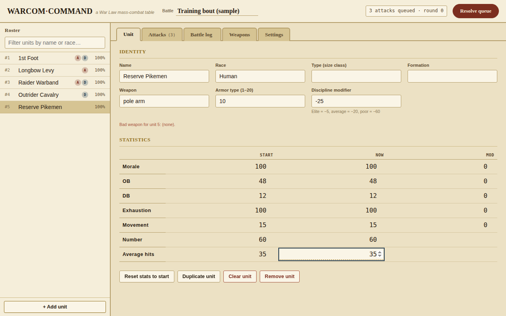

Four buttons below the statistics table:

- **Reset stats to start** — copies every `Start` value back into `Now`
  (the original program's F5 key). Use between battles.
- **Duplicate unit** — exact copy, handy for building a roster quickly.
- **Clear unit** — blanks the fields without removing the slot.
- **Remove unit** — deletes the unit and renumbers any attacks that
  referenced it.

### Filtering the roster

The search box above the roster matches against name and race as you type.

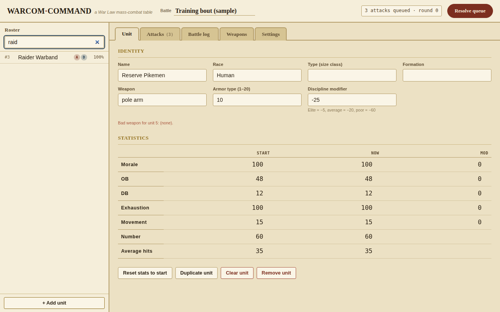

### Queuing attacks

Switch to **Attacks** to build the round's queue. Each row is one attack.

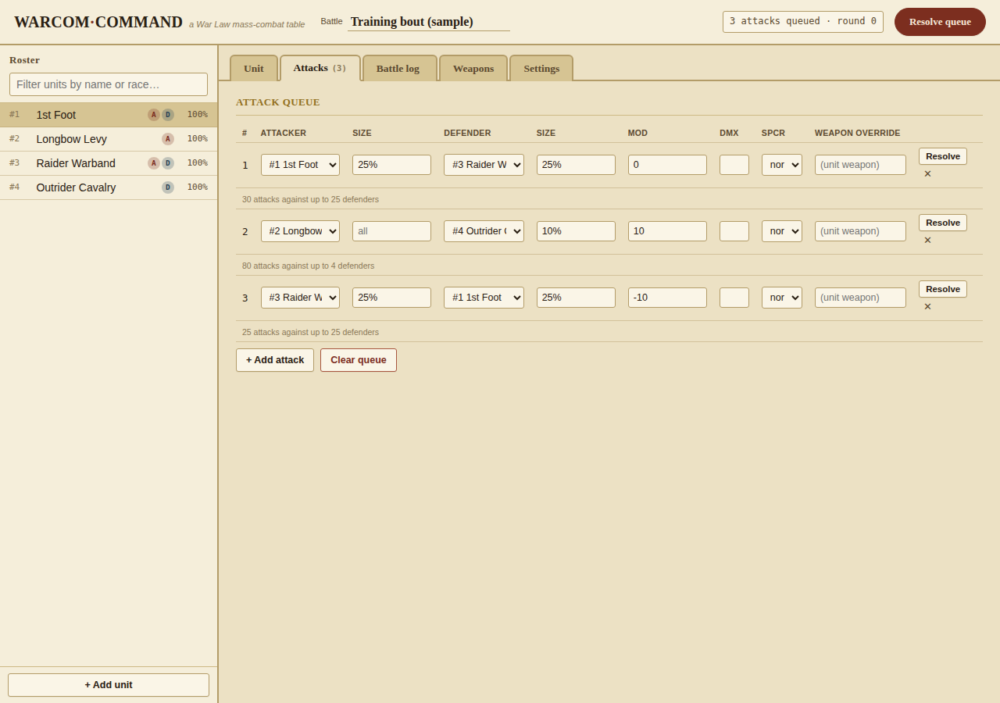

Click **+ Add attack** for a row (it stays hidden until you've picked at
least an attacker or defender, to avoid table clutter). Fields:

- **Attacker / Defender** — from the roster.
- **Size** (one per side) — blank for the whole unit, a percentage
  (`25%`), or an absolute troop count — same syntax the original used.
- **Mod** — a numeric modifier for this attack only.
- **Dmx** — a single-character concussion-damage multiplier code.
- **SpCr** — special critical mode: normal, double, kata, magic, holy,
  slaying.
- **Weapon override** — blank uses the attacker's own weapon; type a
  different name to use its table just for this attack.

Under each row, a note explains how it expands ("28 attacks against up to
24 defenders") or flags a problem before you resolve anything. Each row
also has its own **Resolve** button to run just that attack immediately.

### Resolving combat

Click **Resolve queue** (or a row's own **Resolve**). Every queued attack
is rolled with the same RNG routines as the original, unit stats update
immediately, and an entry lands in the battle log.

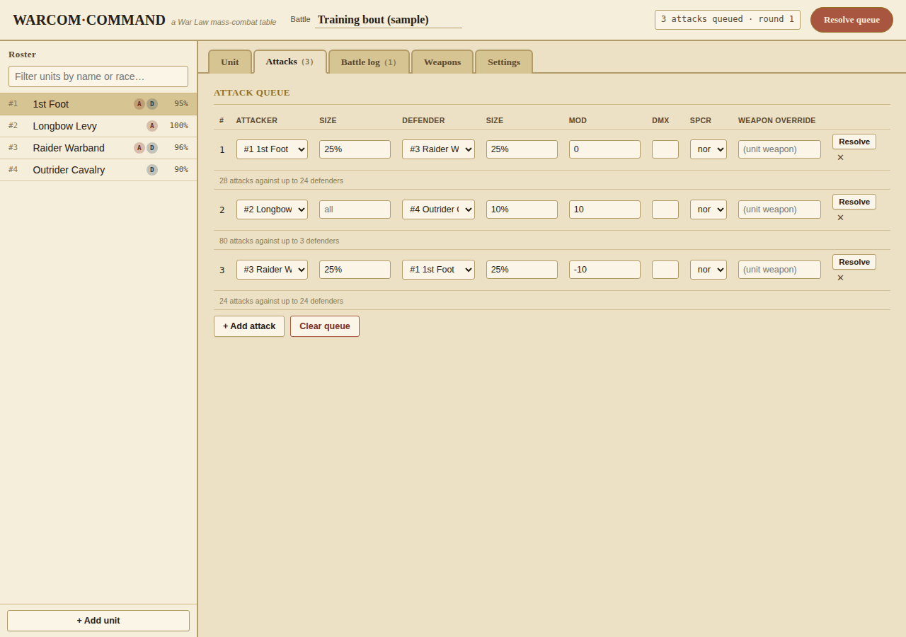

The queue stays in place afterward, so you can tweak modifiers and resolve
another round without rebuilding it.

### The battle log and undo

**Battle log** keeps a running history, newest first — who attacked whom,
with what weapon, how many attacks landed, casualties, and total damage.

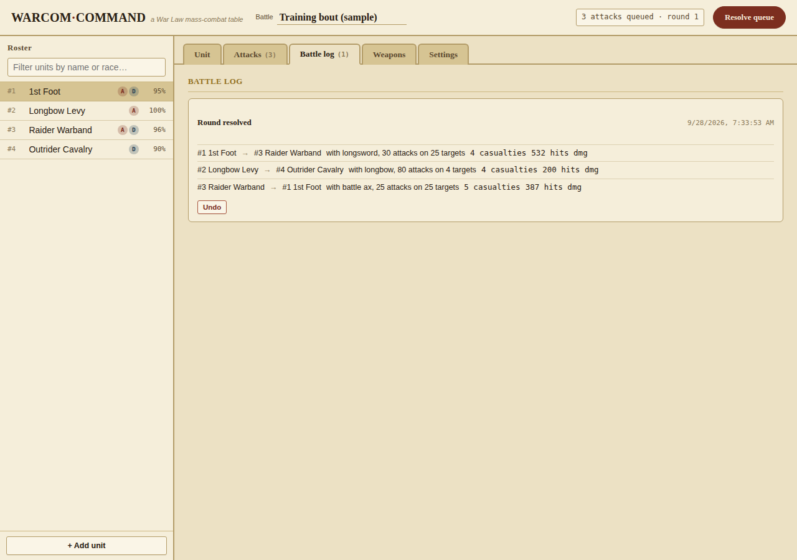

Each entry has its own **Undo**, which reverts every unit to its
statistics from just before that resolution and removes the entry. It asks
for confirmation first, since it can't be redone:

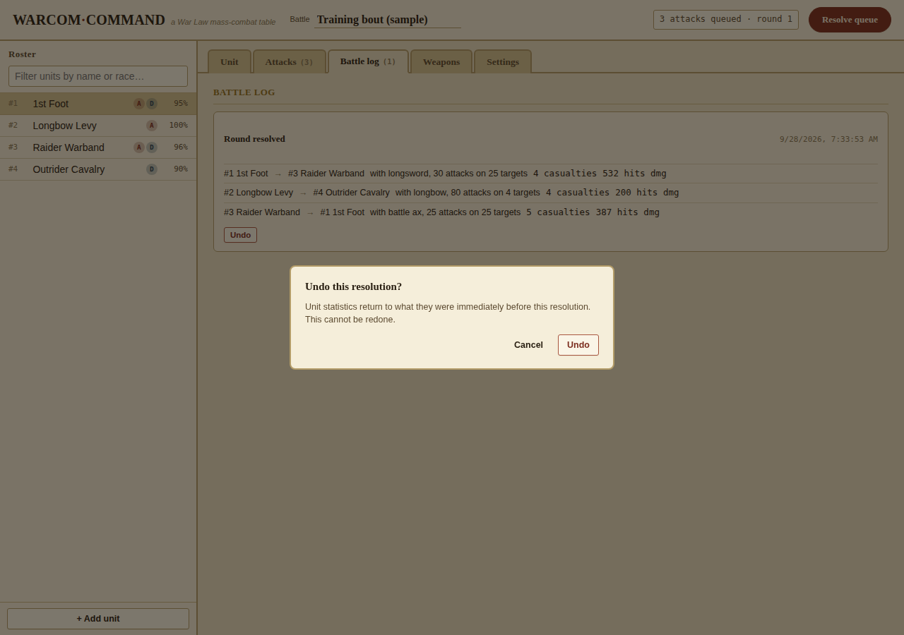

> Undo restores a saved snapshot from just before that specific
> resolution, for entries still in the log this session — it isn't a full
> history you can step through freely.

### The weapons reference

**Weapons** is a browsable copy of the original `WEAPONS.DAT` — every
weapon's armor-type breakpoints and critical-severity columns (E–A) by
armor type. Click a weapon on the left to see its table.

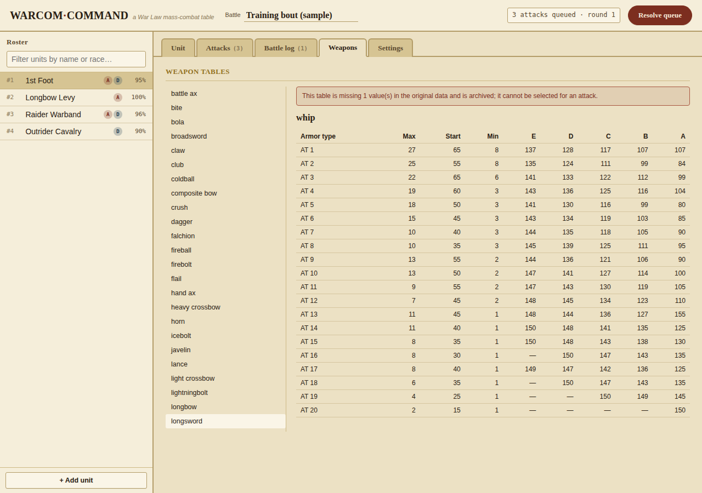

One entry, **whip**, is marked *(incomplete)*: the original `WEAPONS.DAT`
file itself is missing one data value for it. Rather than inventing a
number to fill the gap, the table is shown for reference but can't be
selected for an attack.

### Settings and combat rules

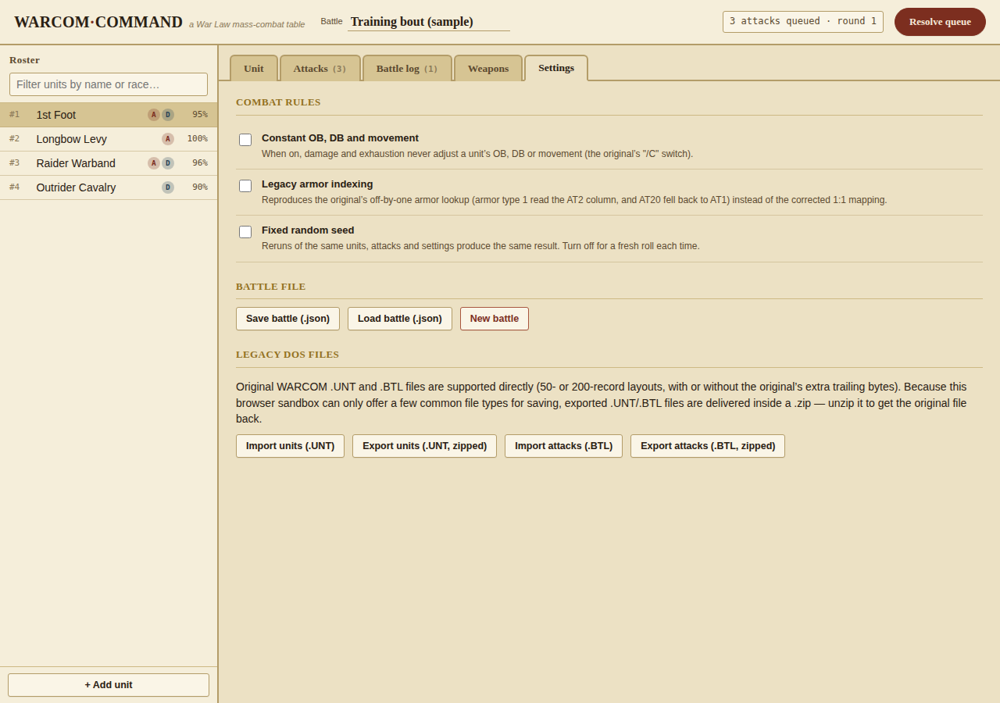

**Combat rules**

- **Constant OB, DB and movement** — damage and exhaustion never adjust
  OB/DB/movement (the original's `/C` switch).
- **Legacy armor indexing** — reproduces the off-by-one armor bug
  described [above](#how-it-was-ported) exactly. Off by default (corrected
  mapping); turn on to match old saved results.
- **Fixed random seed** — same units/attacks/settings always produce the
  same result; useful for testing. A `Seed` field appears when enabled.

**Battle file** — `Save battle (.json)` / `Load battle (.json)` store the
whole battle (roster, queue, log, round counter, settings) in one native
JSON file. `New battle` clears everything (with confirmation).

**Legacy DOS files** — reads and writes the original formats directly,
both the 50- and 200-record layouts, with or without the original's extra
trailing bytes. Because a browser can only offer a limited set of
downloadable types, exported `.UNT`/`.BTL` files arrive inside a `.zip` —
unzip it to get the original file back, byte-for-byte.

The original format uses short, fixed-width fields (e.g. a unit name is
capped at 30 characters). If your data won't fit, export stops and shows
exactly which fields are the problem, rather than silently truncating:

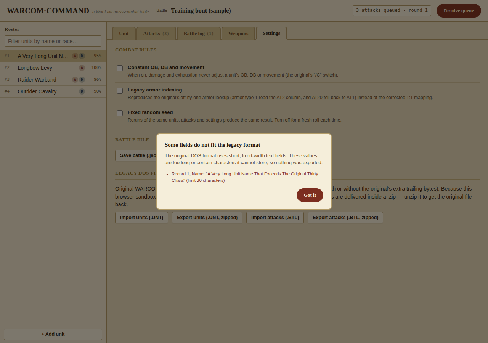

| Format | Use for | Where |
|---|---|---|
| `.json` | Saving/loading a full battle in this app's own format | Settings → Battle file |
| `.UNT` (zipped) | Original DOS unit roster files | Settings → Legacy DOS files |
| `.BTL` (zipped) | Original DOS attack/battle files | Settings → Legacy DOS files |

> Work also autosaves to the browser's local storage as you go. That's
> local to the browser/machine you're using — not a substitute for saving
> a `.json` if you want a portable copy.

### Worked example: a skirmish

Walking through the sample battle loaded by default:

1. **Roster**: *1st Foot* and *Longbow Levy* on one side, *Raider Warband*
   and *Outrider Cavalry* on the other.
2. **Queue**: three attacks are pre-loaded — 1st Foot vs. Raider Warband
   (25% each side), Longbow Levy vs. Outrider Cavalry (full unit vs. 10%,
   +10 modifier), Raider Warband vs. 1st Foot (25% each side, −10
   modifier).
3. **Resolve**: click **Resolve queue**. One run produced 4 casualties /
   532 damage, 4 casualties / 200 damage, and 5 casualties / 387 damage
   across the three attacks respectively (your numbers will differ unless
   "Fixed random seed" is on).
4. **Read the results** in Battle log, or glance at the roster — strength
   percentages drop for units that took casualties.
5. **Adjust and continue** — tweak a modifier, resolve again, or **Undo**
   from the log if a round needs rolling back.

### Tips and troubleshooting

- **"Bad weapon" / a flagged attack row** — the weapon name doesn't match
  anything in Weapons. Check spelling; note "whip" specifically can't be
  used (incomplete table).
- **Export refuses with a field-length error** — shorten the flagged
  value; nothing exports until every field fits.
- **Importing `.UNT`/`.BTL`** — a raw file or a `.zip` containing one are
  both accepted. Importing units replaces the whole roster and clears the
  attack queue/log (unit references must stay correct) — you'll be asked
  to confirm.
- **Reproducible results** — turn on "Fixed random seed" before resolving.
- **Comparing against old saved results** — turn on "Legacy armor
  indexing".
- **Dark mode** — follows your system setting automatically; no in-app
  switch.

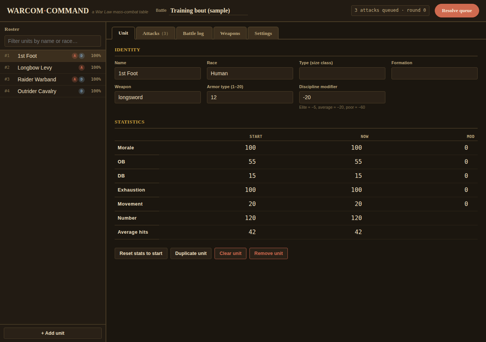

## The offline runtime

`warcom-command-offline.zip` is the same app pre-bundled so it runs from a
plain double-clicked `index.html`, with no server and no network access:

- The engine and UI are bundled into a single plain `<script>`
  (`bundle.js`, built with esbuild), instead of ES module imports, which
  browsers refuse to load over `file://`.
- JSZip is vendored locally (`vendor-jszip.min.js`, unmodified upstream
  v3.10.1) instead of loaded from a CDN, so the `.UNT`/`.BTL` zip
  export/import still works offline.
- File saving uses a plain `Blob` + `<a download>` browser download,
  rather than the hosted version's platform-specific save API.
- Fonts fall back to your system's serif/sans/monospace instead of
  downloading from Google Fonts.

See the `README.txt` inside the zip for details. It's fully cross-platform
(Windows/macOS/Linux) and needs no internet connection — the whole app,
combat engine, weapon tables, and legacy file support are included.

## License

GPL-3.0, inherited from the original Warcom (David Eubanks). See
[`LICENSE`](LICENSE). The original DOS source in `legacy/` is reproduced
unmodified, with permission, from
[github.com/code-moth/Warcom](https://github.com/code-moth/Warcom).
